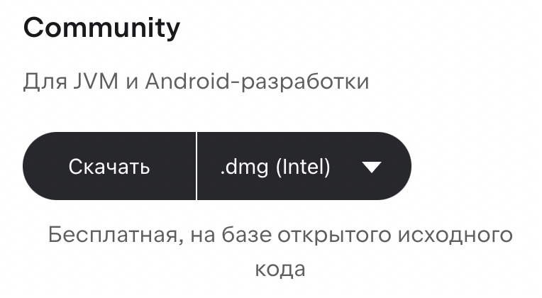
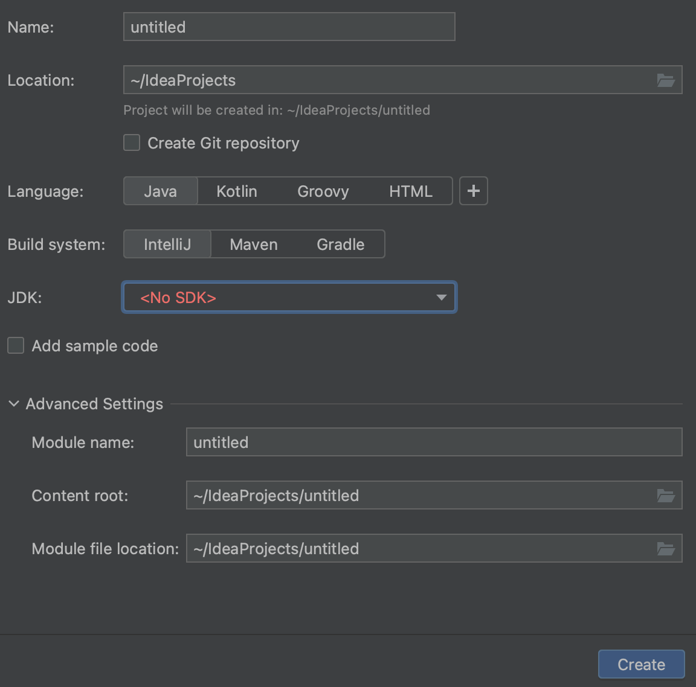
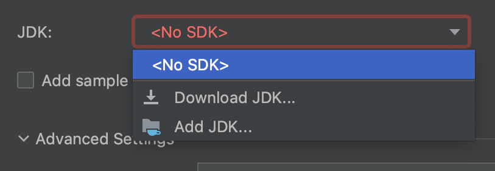
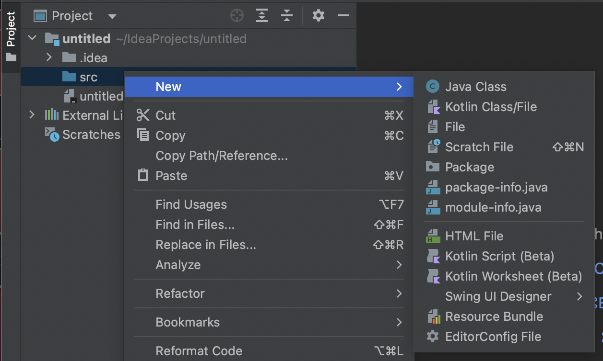
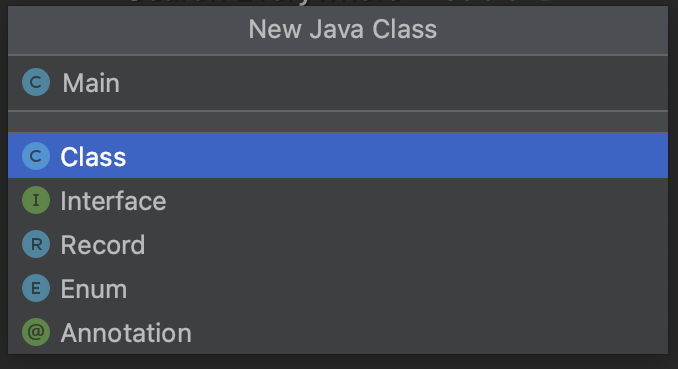

# Домашнее задание к занятию "Java"

Итак, для того чтобы начать программировать, вам нужна специальная программа. С этого мы и начнем! Ваша задача подготовиться к дальнейшим занятиям, скачать, установить и настроить IDE. Вперед!)

Для выполнения задания и дальнейшего прохождения курса требуется компьютер с операционной системой Windows, MacOS или Linux

------

## Инструкция по установке IntelliJ IDEA

Шаг 1. Перейдите по адресу [Intellij Idea, версия Community](https://www.jetbrains.com/ru-ru/idea/), нажмите кнопку "Скачать":

Шаг 2. Выберите необходимую ОС (Windows, macOS, Linux):

Шаг 3. В разделе Community нажмите кнопку "Скачать":

Шаг 4. Дождитесь загрузки файла, запустите его, и нажмите кнопку "Установить". Дождитесь завершения установки и нажмите кнопку "Готово"

Шаг 5. Прочитайте лицензионное соглашение, поставьте галочку и нажмите кнопку "Continue":

Шаг 6. Далее выйдет окно с просьбой помочь IntelliJ IDEA улучшить свои продукты, отправляя анонимные данные об используемых функциях и плагинах, конфигурации оборудования и программного обеспечения, статистику по типам файлов, количеству файлов в проекте и т. д. Если вы не хотите делиться данными, выберите кнопку "Don't Send". Если вы хотите делиться данными, выберите кнопку "Send Anonymous Statistics":

Шаг 7. У вас откроется стартовое программы:

Шаг 8. Нажмите кнопку "New Project":

Шаг 9. В появившемся окне в поле "Language" выберите "Java", в поле "System" выберите "IntelliJ":

Шаг 10. В поле "JDK" выберите "Download JDK" 

Шаг 11. В появившемся окне в поле "Version" выбираем "17" и нажимаем кнопку "Download"

Шаг 12. Дождитесь загрузку, затем появится окно, в котором в поле "JDK" выбрана версия 17. Теперь в правом нижнем углу нажмите кнопку "Create": 

Шаг 13. При первом запуске IntelliJ IDEA понадобится какое-то время, чтобы проиндексировать вашу установку JDK. Это отобразится в правом нижнем углу окна, подождите, пока все процессы завершатся:

Шаг 14. Перед вами панель проекта. Папки называются каталоги. Вы видите вложенность одних папок в другие — это структура каталогов:

Шаг 15. На каталог `src` щёлкните правой кнопкой мыши и выберите "New" -> "Java Class":

Шаг 16. В открывшемся окне введите `Main` и нажмите клавишу "Enter":

Шаг 17. Это ваше рабочее пространство. Справа вы видите код:

Шаг 18. Замените код из открывшегося файла [вот этим кодом](Example.java), чтобы текущее состояние соответствовало тому, что вы видите на экране:

Шаг 19: Нажмите на зелёную стрелку перед первой строкой, затем выберите "Run 'Main.main()'":

Шаг 20: Немного подождите. Вы написали свою первую простую программу, которая выведет слова `Hello programming`, и только что запустили её. Внизу окна появится вывод программы. Удостоверьтесь, что вывод программы соответствует скриншоту:

Поздравляем! Вы успешно установили IntelliJ IDEA и запустили своё первое Java-приложение!

## Задания для практики
Следующие задания являются дополнительными, но мы рекомендуем их выполнить, так как практика является очень важной частью изучения языков программирования.

### Задание 1
Для практической работы мы подготовили программу, позволяющую угадывать слово по буквам. Код программы доступен [по ссылке](Main.java).
- Скопируйте этот код, запустите его и попробуйте вводить разные буквы, чтобы увидеть результат работы программы
- Затем изучите код, почитайте комментарии, чтобы понять логику работы программы. Не переживайте, если не удается понять смысл каждой строчки кода, сейчас важно понять общую суть программы
- Попробуйте поменять загаданное слово word и еще раз протестировать работу программы

### Задание 2
Сейчас игра всегда загадывает одно и то же слово. Давайте сделаем так, чтобы она случайным образом выбирала одно из нескольких слов.
*Для этого нужно:*
- Добавить в класс `Main` поле `static String[] words`, которое будет хранить массив слов для загадывания
- Написать метод `private static String chooseWord(String[] arr)`, который будет из переданного ему массива выбирать случайное слово и возвращать в качестве результата своей работы
- В начале функции `main` вызвать метод `chooseWord`, чтобы присвоить значение полю word

### Задание 3
Продолжаем улучшать программу. Сейчас `word` является статическим полем класса, чтобы уменьшить область видимости `word`, нужно сделать его не статическим полем, а переменной внутри метода `main`. 
*Для этого нужно:*
- Удалить поле `word`
- Объявить переменную `word` внутри метода `main`
- В метод `replaceMaskLetter`, который раньше использовал поле `word` класса `Main`, передавать переменную `word`
